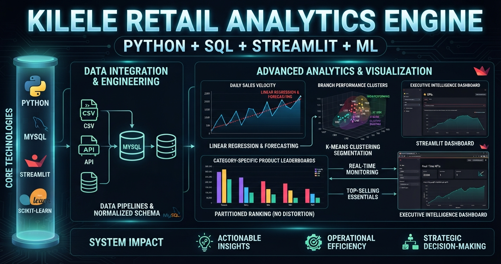

# 🚀 Kilele Retail Analytics Engine


# 🚀 Kilele Retail Analytics Engine

<p align="center">
  
</p>

---

<p align="center">
  <b>An end-to-end retail data pipeline connecting MySQL, Python automation, and an interactive Streamlit executive dashboard.</b>
</p>

---

## 📋 Table of Contents
1. [Project Overview](#1-project-overview)
2. [The Problem](#2-the-problem)
3. [Project Objectives](#3-project-objectives)
4. [Solution Architecture](#4-solution-architecture)
5. [System Walkthrough & Visualizations](#5-system-walkthrough--visualizations)
6. [Tech Stack](#6-tech-stack)
7. [Installation & Usage](#7-installation--usage)

---

## 1. Project Overview
The **Kilele Retail Analytics Engine** is a comprehensive, production-grade retail data platform. It links a normalized MySQL relational database (`kilele_retail_db`) with automated Python backend scripts and a responsive Streamlit web application. The system enables stakeholders to track real-time store performance, evaluate daily revenue velocity, monitor branch profitability, and analyze category-partitioned product leaderboards.

---

## 2. The Problem
Prior to this system, enterprise retail data was fragmented across uncoordinated local files and manual spreadsheets. Store managers lacked a centralized, real-time interface to compare cross-branch performance across locations like Westlands, CBD, Lang'ata, and Kasarani. Furthermore, traditional analytics tools suffered from distortion caused by high-ticket items (such as bulk cooking oil), which routinely overshadowed everyday essential commodities (such as milk, sugar, and flour) in standard reports.

---

## 3. Project Objectives
* Establish a robust relational database schema to eliminate data duplication and maintain transaction integrity.
* Implement advanced SQL window functions to handle category-specific product rankings and day-to-day revenue variance.
* Build an automated Python analytics pipeline utilizing Pandas and NumPy.
* Deploy a fully interactive, dark-themed Streamlit dashboard featuring executive KPIs, regression forecasting, and machine learning cluster analysis.

---

## 4. Solution Architecture
* **Relational Database (`MySQL Workbench`):** Normalized multi-table architecture covering branches, categories, products, and transactions.
* **Advanced Analytics (`SQL & Pandas`):** Execution of window functions (`ROW_NUMBER()`, `LEAD()`) and programmatic dataset processing.
* **Executive Dashboard (`Streamlit & Plotly`):** Responsive web interface delivering dynamic filtering, KPI calculation, and visual data storytelling.

---

## 5. System Walkthrough & Visualizations

### Daily Sales Trend: CBD Branch (`CBD_01`)
> This line chart tracks daily sales velocity for the CBD branch using the interactive sidebar filter. It displays a steady climb from late August, peaking around August 30th before a brief mid-week dip and a strong recovery leading into September 3rd, providing precise visibility into foot traffic patterns in the central business district.
> 
> 

### Daily Sales Trend: Westlands Branch (`WST_02`)
> Switching the filter to the Westlands branch illustrates a high-value sales trend. The visualization captures a significant revenue peak at the end of August reaching nearly 9,000 KES, followed by stable mid-week trading activity that assists inventory teams in preparing for high-volume weekends.
> 
> 

### Daily Sales Trend: Kasarani Branch (`KSR_03`)
> Examining the Kasarani branch highlights consistent, reliable baseline performance with daily transactions hovering between 2,500 and 4,000 KES, showing an upward recovery trajectory toward Thursday, September 3rd, and proving a steady baseline of customer purchases.
> 
> 

### Daily Sales Trend: Lang'ata Branch (`LNG_04`)
> This visualization maps sales velocity across late August and early September for the Lang'ata branch. It demonstrates a sharp climb from a late-August dip to peak near 7,000 KES mid-week on September 2nd, offering clear insights into localized buying behavior in the southern residential zones.
> 
> 

### Top Products Revenue Breakdown (CBD Location)
> Pairing transaction logs with product-level revenue contributions for the CBD store identifies primary traffic drivers. Items such as Supa Dafra Rice 5kg lead store contributions at 6,500 KES, confirming that essential bulk grains drive high-volume customer movement in urban retail spaces.
> 
> 

### MySQL Daily Sales Performance Query
> Clean backend architecture is maintained through structured database operations. In MySQL Workbench, this daily sales performance query groups transactions by date, aggregating total transactions, units sold, and daily gross revenue to guarantee absolute mathematical accuracy across all downstream metrics.
> 
> 

### VS Code Python Analytics Terminal Output
> Executing the Python analytics engine live within VS Code establishes a direct connection to the MySQL database via Pandas. Automated reporting scripts process product performance and branch summaries, outputting metrics directly to the terminal where Kilele Westlands leads branch revenue at 29,800 KES and Supa Dafra Rice leads product totals at 27,950 KES.
> 
> 
> 

### Streamlit Executive Overview & KPI Summary
> The main executive landing page of the web application presents a high-level enterprise summary. KPI cards instantly display total enterprise gross revenue standing at 85,150 KES across 19 transactions and 295 units sold, accompanied by a dynamic bar chart ranking branch locations.
> 
> 

### Branch Performance Clusters (3D Visualization)
> Applying K-Means clustering segments retail branches based on Recency, Frequency, and Monetary (RFM) operational metrics. The 3D scatter plot visualizes distinct branch groupings, providing a quantitative framework to distinguish top-tier locations from stores requiring strategic operational intervention.
> 
> 

### Master Relational Data Extraction
> This master relational query executed in MySQL Workbench joins branches, categories, products, and transactions into a unified grid. This structural design ensures that every visual element and KPI on the dashboard traces back to verified, immutable transaction records.
> 
> 

### Enterprise Daily Revenue Trend
> Zooming out to an enterprise-wide perspective, this aggregate line chart tracks daily revenue across all stores. It isolates a market surge exceeding 16,000 KES on September 2nd following a beginning-of-month adjustment on September 1st, supporting precise cash flow planning.
> 
> 

### Gross Revenue by Branch Comparison
> This executive comparative bar chart ranks the four retail locations by total gross revenue. Kilele Westlands leads the enterprise at 29,800 KES, followed by CBD at 23,500 KES, Lang'ata at 17,200 KES, and Kasarani at 14,650 KES.
> 
> 

### Product Ranking by Category (SQL Window Functions)
> Utilizing the `ROW_NUMBER() OVER (PARTITION BY c.category_name ORDER BY SUM(t.total_amount) DESC)` window function ensures products are ranked independently within their respective categories. This prevents high-ticket luxury or bulk items from distorting category-specific management reports.
> 
> 

### Chronological Branch Sales & Lead-Lag Analysis
> Advanced analytical modeling is implemented via the SQL `LEAD()` window function to preview upcoming transaction amounts and calculate day-over-day revenue differences, delivering predictive visibility into operational momentum shifts at the branch level.
> 
> 

### Category-Specific Product Leaderboards (Cereals & Flour)
> Filtering the Streamlit category leaderboards by Cereals & Flour isolates core household staples including Supa Dafra Rice, Kabras Sugar, and Jogoo Unga, ensuring everyday essential commodities maintain clear visibility in executive reporting.
> 
> 
> 

### Cooking Oils & Fats Leaderboard
> Adjusting the category filter to Cooking Oils & Fats instantly isolates Baraka Cooking Oil 3L as the dominant category leader, recording over 15,000 KES in revenue contributions.
> 
> 

### Fresh Dairy & Tea Leaderboards
> Category-partitioned leaderboards highlight high-turnover daily necessities such as Brookside Fresh Milk 500ml under Fresh Dairy, and Kericho Gold Tea 500g under Tea & Hot Drinks, with color-graded rank scales providing immediate visual confirmation of market share.
> 
> 

---

## 6. Tech Stack
* **Programming Language:** Python
* **Web Framework:** Streamlit
* **Data Visualization:** Plotly
* **Database System:** MySQL & MySQL Workbench
* **Data Manipulation & Machine Learning:** Pandas, NumPy, Scikit-Learn

---

## 7. Installation & Usage

1. **Clone the Repository:**
   ```bash
   git clone [https://github.com/steph45acke-hue/KILELE_RETAILS_ANALYTICS_ENGINE.git](https://github.com/steph45acke-hue/KILELE_RETAILS_ANALYTICS_ENGINE.git)
Configure Database:
Ensure your local MySQL server is active and load the kilele_retail_db schema.

Install Dependencies:

Bash
pip install -r requirements.txt
Run the Application:

Bash
streamlit run app_v1.py
Access Dashboard:
Open your browser at http://localhost:8501.